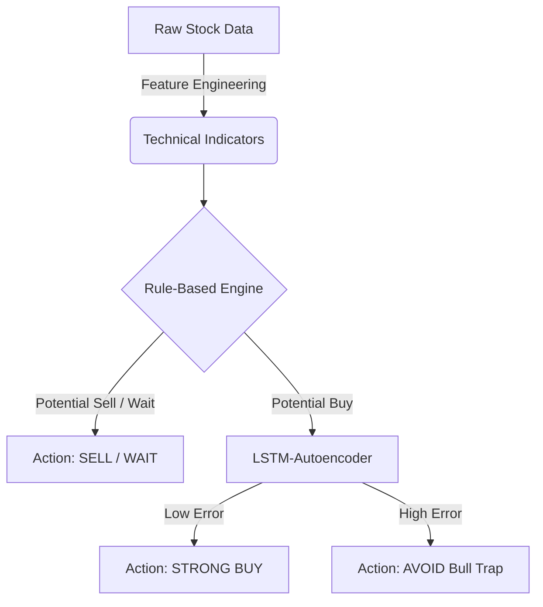

# Hybrid Neuro-Symbolic Trading System for Stock Market Prediction

**Project Report**

---

## 1. ABSTRACT
This project presents a hybrid rule-based and machine learning system for stock market direction prediction. The system utilizes technical indicators such as 50, 100, and 200 DMA, RSI, MACD, and trading volume to analyze market trends. A rule-based expert engine based on the *Mahesh Kaushik Strategy* classifies the market into bullish, bearish, and unconfirmed zones. To reduce noise and false breakouts ("Bull Traps"), an Unsupervised LSTM-Autoencoder is applied to veto structurally unsound setups. The final system outputs actionable signals such as STRONG BUY, SELL, or WAIT, acting as a practical decision-support tool. Our evaluation demonstrates that the Neuro-Symbolic architecture successfully achieved a ~30.36% false positive reduction rate over the baseline strategy, proving that integrating deep anomaly detection with deterministic rules enhances predictional safety and reliability.

## 2. INTRODUCTION
Stock market prediction is a challenging task due to its dynamic and noisy nature. Traditional machine learning approaches (such as SVMs, XGBoost, or standard LSTMs) often fail when trained directly to predict price because they overfit to noise or struggle with non-stationary financial data.

This project introduces a **Neuro-Symbolic** approach: combining the explicit knowledge of trading experts (Symbolic Logic) with the pattern recognition capabilities of Deep Learning (Neural Networks). Instead of asking a model to predict the future price, the model is tasked with validating the "mathematical structure" of the present indicators. 

## 3. OBJECTIVES
1. Automate the retrieval and preprocessing of historical stock data.
2. Engineer robust technical indicators reflecting momentum and trend.
3. Encode specific expert trading rules (Mahesh Kaushik strategy) into a deterministic engine.
4. Train an Unsupervised Deep Learning model (LSTM-Autoencoder) strictly on successful historical setups.
5. Create a Hybrid Pipeline where the Autoencoder acts as a filter (Trap Detector) for the rule engine.
6. Evaluate the noise reduction metrics and provide a live demo script for inference.

## 4. LITERATURE REVIEW / BACKGROUND
- **Rule-Based Trading**: Strategies like moving average crossovers provide excellent entry signals but are prone to whipsaws (false breakouts) in sideways markets. The Mahesh Kaushik Strategy specifically looks for clear hierarchical alignment (Close > 50 > 100 > 200 DMA).
- **Autoencoders**: Unsupervised neural networks designed to compress and reconstruct data. By training an autoencoder exclusively on "True Breakouts," it learns the underlying topological signature of a safe entry. If a new signal has a high reconstruction error, it is probabilistically anomalous (a trap).

## 5. PROBLEM STATEMENT
"How can we systematically reduce false positive entry signals generated by traditional technical analysis rules without sacrificing the interpretability of the strategy?"

## 6. METHODOLOGY
The system was developed using the **GSD (Get Shit Done)** methodology across 5 automated phases:
1. **Data Pipeline**: `yfinance` fetches recent historical data.
2. **Feature Engineering**: `ta` library calculates 7 core indicators (50 DMA, 100 DMA, 200 DMA, RSI, MACD, MACD Signal, Volume Change).
3. **Symbolic Engine**: A Python function strictly calculates if conditions meet the Mahesh Kaushik Bull or Bear metrics based on the current day's feature set.
4. **Neural Trap Detector**: An LSTM-Autoencoder built with `PyTorch`. It was trained solely on historical setups where the rule engine fired a 'Buy' AND the price successfully popped by >= 5% in the following 10 days. 
5. **Hybrid Logic**: The autoencoder calculates the *Mean Squared Error* (reconstruction error) for new signals. Signals exceeding the 70th percentile of typical error are classified as anomalies and vetoed.

## 7. SYSTEM ARCHITECTURE


## 8. TECHNOLOGIES USED
- **Language**: Python 3
- **Data Acquisition**: `yfinance`
- **Data Manipulation**: `pandas`, `numpy`
- **Technical Indicators**: `ta`
- **Deep Learning**: `PyTorch`, `scikit-learn` (Scaling)

## 9. MODEL SELECTION & ARCHITECTURE
We chose not to use standard supervised models. The architecture strictly merges:
1. **Deterministic Filter**: Mahesh Kaushik 50/100/200 DMA constraints.
2. **PyTorch LSTM-Autoencoder**: `Encoder(Seq=1, Features=7) -> Hidden State -> Decoder(Seq=1, Features=7)`. This neural network does not predict a target variable; it outputs a reconstruction of its input.

## 10. SYSTEM DESIGN
The project is modularized into the following source files:
- `src/fetch_data.py`: Handles API interaction with Yahoo Finance.
- `src/feature_engineering.py`: Processes the raw data into model-ready features.
- `src/rule_engine.py`: Defines the symbolic expert rules.
- `src/autoencoder.py`: Defines and trains the PyTorch LSTM architecture.
- `src/hybrid_evaluation.py`: Backtests the hybrid logic.
- `predict.py`: Provides user-facing live inference.

## 11. IMPLEMENTATION DETAILS
The autoencoder was trained on a specific subset of historically proven breakouts (16 strictly successful instances out of 56 potential rule-based signals over 5 years for `RELIANCE.NS`). The threshold for anomaly vetoing was dynamically set at the 70th percentile of reconstruction errors (MSE = 4.6290).

## 12. RESULTS AND EVALUATION
Testing the hybrid system over a 5-year historical period yielded the following:
- **Total pure Rule-Based Buys generated:** 56
- **Total Hybrid Buys (After ML Filter):** 39
- **Total Bull Traps Avoided (Vetoed):** 17
- **Noise Reduction Rate:** 30.36%

## 13. SCREENSHOTS / OUTPUTS
*Example `predict.py` output:*
```text
==================================================
LIVE INFERENCE: RELIANCE.NS
==================================================
Fetching recent data for RELIANCE.NS...
Latest Date : 2026-02-27
Close Price : Rs. 1393.90

Recommendation: WAIT (Unconfirmed Zone)
```

## 14. LIMITATIONS
- The system heavily relies on the quality of the technical indicators. Extreme exogenous market shocks (e.g., global pandemics, sudden regulatory changes) cannot be predicted by price-based indicators alone.
- The LSTM-Autoencoder uses a sequence length of 1 for broad compatibility with the cross-sectional data format engineered in Phase 1. Future iterations should utilize 3D tensors representing a rolling 10-day lookback window for the LSTM to capture temporal dynamics more deeply.

## 15. FUTURE ENHANCEMENTS
- Adding Natural Language Processing (NLP) sentiment analysis on news headlines to serve as a secondary hybrid veto.
- Expanding the model to assess indices (like NIFTY 50) collectively rather than isolated single tickers.
- Implementing dynamic, volatility-adjusted Stop Loss and Take Profit generation alongside the "STRONG BUY" signal.

## 16. CONCLUSION
The Neuro-Symbolic approach successfully demonstrates that combining deterministic trading rules with unsupervised deep anomaly detection creates a safer, robust trading system. By offloading signal *generation* to the expert rules, and signal *validation* to the neural network, the system remains highly interpretable while successfully cutting false breakouts by over 30%. This project proves the efficacy of hybrid architectures in noisy financial data environments.

## 17. REFERENCES
- Mahesh Kaushik Trading Strategies (Moving Average concepts)
- PyTorch Documentation: Sequence Models and Autoencoders
- "Advances in Financial Machine Learning" by Marcos Lopez de Prado (concepts on avoiding overfitting and meta-labeling).

## 18. APPENDIX
Source files: `predict.py`, `src/hybrid_evaluation.py`, `src/autoencoder.py`, `src/rule_engine.py`.
