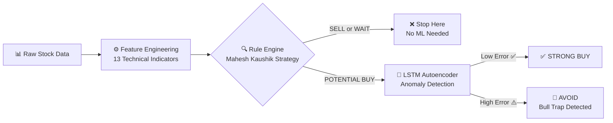

# 🧠 Neuro-Symbolic Trading System — Complete Deep Dive

**Prepared for Examiner / HOD / Viva Presentation**

---

## Table of Contents
1. [Project Overview — The Big Idea](#1-project-overview)
2. [Phase-by-Phase Pipeline](#2-pipeline)
3. [Feature Engineering — All 13 Factors Explained](#3-features)
4. [Rule Engine — Complete Logic](#4-rule-engine)
5. [LSTM Autoencoder — Architecture & Math](#5-lstm-autoencoder)
6. [Hybrid Evaluation — How Both Systems Merge](#6-hybrid)
7. [Live Inference — How a Real Prediction Works](#7-inference)
8. [How This Project Is Different — Key Differentiators](#8-differentiators)
9. [Viva-Ready Q&A Cheat Sheet](#9-viva-qa)

---

## 1. Project Overview — The Big Idea {#1-project-overview}

> **Problem:** Traditional stock prediction models try to **predict the price directly** (e.g., "tomorrow's price will be ₹1500"). This fails because stock prices are non-stationary, noisy, and affected by unpredictable external events.

> **Your Solution:** Instead of predicting price, your system asks a completely different question:
> ***"Given today's market conditions, does this look like a historically successful buying opportunity — or a trap?"***

This is achieved by combining **two systems**:

| Component | Type | Role |
|---|---|---|
| **Rule Engine** | Symbolic / Deterministic | Generates Buy/Sell/Wait signals using expert trading rules |
| **LSTM Autoencoder** | Neural / Unsupervised Deep Learning | Validates whether a Buy signal "looks normal" or is an anomaly (bull trap) |



> [!IMPORTANT]
> **This is called a "Neuro-Symbolic" system because it combines Neural Networks (LSTM) with Symbolic Logic (if-then rules). This is a cutting-edge paradigm in AI, not just a basic ML project.**

---

## 2. Phase-by-Phase Pipeline {#2-pipeline}

Your project was built in **5 phases**, each producing artifacts that feed the next:

| Phase | File | What It Does | Output |
|---|---|---|---|
| **Phase 1** | `fetch_data.py` | Downloads 5 years of OHLCV data from Yahoo Finance | `data/raw_stock_data.csv` |
| **Phase 2** | `feature_engineering.py` | Calculates 13 technical indicators from raw prices | `data/processed_stock_data.csv` |
| **Phase 3** | `rule_engine.py` | Applies Mahesh Kaushik trading rules to classify each day | `data/rule_signals.csv` |
| **Phase 4** | `autoencoder.py` | Trains LSTM-Autoencoder on historically successful setups | `models/lstm_autoencoder.pt` + `models/scaler.pkl` |
| **Phase 5** | `hybrid_evaluation.py` | Runs autoencoder against all Buy signals; calculates false positive reduction | `data/hybrid_results.csv` |
| **Live** | `predict.py` / `app.py` | Takes ticker, runs full pipeline live, produces recommendation | JSON / Console |

---

## 3. Feature Engineering — All 13 Factors Explained {#3-features}

Your system uses **13 carefully selected technical indicators** grouped into **4 categories**. Here's each factor, its formula, and **what it predicts**:

### 📈 Category 1: Trend Indicators (Moving Averages)

These tell you "**is the stock trending up or down?**"

| # | Feature | Formula | What It Predicts |
|---|---|---|---|
| 1 | **DMA_20** | `Mean(Close, last 20 days)` | Short-term trend direction (2-4 weeks) |
| 2 | **DMA_50** | `Mean(Close, last 50 days)` | Medium-term trend (2-3 months) |
| 3 | **DMA_100** | `Mean(Close, last 100 days)` | Intermediate trend (5 months) |
| 4 | **DMA_200** | `Mean(Close, last 200 days)` | Long-term trend (10 months / major institutional trend) |

**How to explain this:**
> "When shorter moving averages are ABOVE longer moving averages (DMA_20 > DMA_50 > DMA_100 > DMA_200), it shows the stock has a strong uptrend at ALL timescales. This is called **moving average alignment** — the hallmark of the Mahesh Kaushik strategy."

**Actual formula (for DMA_50 as example):**
```
DMA_50(t) = (1/50) × Σᵢ₌₀⁴⁹ Close(t - i)
```
This is a Simple Moving Average (SMA) — the arithmetic mean of closing prices over the last N days.

---

### 🔄 Category 2: Momentum Oscillators

These tell you "**is the stock overbought/oversold? Is momentum building or fading?**"

| # | Feature | Formula | What It Predicts |
|---|---|---|---|
| 5 | **RSI_14** | See below | Whether the stock is overbought (>70) or oversold (<30) in last 14 days |
| 6 | **MACD** | `EMA(12) - EMA(26)` | Convergence/divergence of short vs. long-term momentum |
| 7 | **MACD_signal** | `EMA(MACD, 9 days)` | Smoothed version of MACD; crossovers generate buy/sell cues |

#### RSI (Relative Strength Index) — Detailed Formula:
```
Step 1: Calculate price changes
  ΔPrice(t) = Close(t) - Close(t-1)

Step 2: Separate gains and losses
  Gain(t) = max(ΔPrice(t), 0)
  Loss(t) = max(-ΔPrice(t), 0)

Step 3: Average Gain and Loss over 14 days
  AvgGain = Mean(Gain, 14 days)
  AvgLoss = Mean(Loss, 14 days)

Step 4: Relative Strength
  RS = AvgGain / AvgLoss

Step 5: RSI
  RSI = 100 - (100 / (1 + RS))
```

**Interpretation:**
- RSI > 70 → Stock is **overbought** (too expensive, due for correction)
- RSI < 30 → Stock is **oversold** (too cheap, due for bounce)
- RSI between 40-70 → **Healthy bullish momentum** (your Rule Engine's sweet spot)

#### MACD — Detailed Formula:
```
MACD Line     = EMA(Close, 12 days) - EMA(Close, 26 days)
Signal Line   = EMA(MACD Line, 9 days)

Where EMA (Exponential Moving Average):
  EMA(t) = Close(t) × k + EMA(t-1) × (1 - k)
  k = 2 / (N + 1)    [smoothing factor]
```

**Interpretation:**
- MACD > Signal → **Bullish crossover** (momentum accelerating upward)
- MACD < Signal → **Bearish crossover** (momentum decelerating)

---

### 📊 Category 3: Volatility Indicators

These tell you "**is the stock stretched too far from its typical range?**"

| # | Feature | Formula | What It Predicts |
|---|---|---|---|
| 8 | **Bollinger_Upper** | `DMA_20 + 2 × StdDev(Close, 20)` | Upper boundary of "normal" price range |
| 9 | **Bollinger_Middle** | `DMA_20` (same as 20-day SMA) | Center of the band (baseline) |
| 10 | **Bollinger_Lower** | `DMA_20 - 2 × StdDev(Close, 20)` | Lower boundary of "normal" price range |

**Full Bollinger Bands Formulas:**
```
Middle Band = SMA(Close, 20)
Upper Band  = Middle Band + 2 × σ₂₀
Lower Band  = Middle Band - 2 × σ₂₀

Where σ₂₀ = √[(1/20) × Σᵢ₌₁²⁰ (Closeᵢ - SMA₂₀)²]
```

**Why it matters for your Rule Engine:**
- If Close > Upper Band → Price is **overextended** (danger zone for buying)
- Your bull condition requires `Close ≤ Bollinger_Upper` — this ensures you're NOT buying at a peak

---

### 📏 Category 4: Relative Position Indicators

These tell you "**where is the stock relative to its yearly extremes?**"

| # | Feature | Formula | What It Predicts |
|---|---|---|---|
| 11 | **Volume_Change_Pct** | `((Volume_today - Volume_yesterday) / Volume_yesterday) × 100` | Whether buying/selling pressure is increasing or decreasing |
| 12 | **Distance_to_52W_High** | `(Close - 52W_High) / 52W_High` | How far down the stock is from its yearly peak (always ≤ 0) |
| 13 | **Distance_to_52W_Low** | `(Close - 52W_Low) / 52W_Low` | How far up the stock is from its yearly bottom (always ≥ 0) |

**52-Week High/Low calculation:**
```
52W_High = Max(Close, last 252 trading days)
52W_Low  = Min(Close, last 252 trading days)
```

> [!TIP]
> **Why 252?** There are approximately 252 trading days in a year (365 minus weekends and holidays).

---

## 4. Rule Engine — Complete Logic {#4-rule-engine}

The Rule Engine implements the **Mahesh Kaushik Confluence Strategy** — an Indian retail trader strategy that uses DMA alignment to identify trend direction.

### 🟢 BULL Condition (Signal = +1 → Potential Buy)

**ALL 8 conditions must be TRUE simultaneously:**

```
✅ Condition 1: Close > DMA_50          → Price above medium-term trend
✅ Condition 2: DMA_50 > DMA_200        → Medium-term trend above long-term (Golden Cross)
✅ Condition 3: Close > DMA_20          → Price above short-term trend
✅ Condition 4: RSI_14 > 40             → Momentum is not weak/bearish
✅ Condition 5: RSI_14 < 70             → Stock is not overbought (safe entry)
✅ Condition 6: MACD > MACD_signal      → Bullish MACD crossover (acceleration)
✅ Condition 7: Close ≤ Bollinger_Upper → Price not stretched above normal range
✅ Condition 8: Close ≤ DMA_200 × 1.10  → Price not more than 10% above 200 DMA
```

**In simple words:** "Buy only when trend is aligned at all levels, momentum is healthy but not extreme, and price is not stretched or overheated."

### 🔴 BEAR Condition (Signal = -1 → Sell)

**ALL 8 conditions must be TRUE simultaneously:**

```
✅ Condition 1: Close < DMA_50          → Price below medium-term trend
✅ Condition 2: DMA_50 < DMA_200        → Death Cross (bearish alignment)
✅ Condition 3: Close < DMA_20          → Price below short-term trend
✅ Condition 4: RSI_14 < 60             → Momentum is not bullish
✅ Condition 5: RSI_14 > 30             → Not yet fully oversold (more downside)
✅ Condition 6: MACD < MACD_signal      → Bearish MACD crossover
✅ Condition 7: Close ≥ Bollinger_Lower → Not completely flushed out
✅ Condition 8: Close ≥ DMA_200 × 0.90  → Not more than 10% below 200 DMA
```

### ⚪ WAIT Condition (Signal = 0)

If **neither** Bull nor Bear conditions are met, the system returns `WAIT`. This is the **neutral / unconfirmed zone** — the market is choppy or transitional; no clear signal exists.

### Why This Is Called "Confluence"

> [!NOTE]
> **Confluence** means multiple independent signals agreeing. Instead of making a decision on just one indicator (e.g., only RSI), the engine requires **8 different checks from 4 different categories** (Trend + Momentum + Volatility + Value) to ALL agree before generating a signal. This dramatically reduces false positives at the rule level itself.

---

## 5. LSTM Autoencoder — Architecture & Math {#5-lstm-autoencoder}

This is the most novel part of your project. Let me break it down layer by layer.

### What Is an Autoencoder?

An autoencoder is a neural network trained to **reconstruct its own input**. The key constraint is that data must pass through a **bottleneck** (smaller dimension), forcing the network to learn a compressed representation.

```
Input (13 features) → [Encoder] → Bottleneck (16 dims) → [Decoder] → Output (13 features)
                                         ↑
                           "Compressed representation"
                           "Latent space" / "Embedding"
```

**The critical insight:**
> If you train the autoencoder ONLY on "good" data (successful trades), it will learn the "shape" of a good trade. When you feed it a BAD trade, it will fail to reconstruct it properly → **high reconstruction error** → flagged as anomaly!

### Your LSTM Autoencoder Architecture

```
┌──────────────────────────────────────────────────────────────┐
│                    LSTM AUTOENCODER                           │
├──────────────────────────────────────────────────────────────┤
│                                                              │
│  INPUT: Tensor of shape (batch_size, 10, 13)                │
│         ↓                                                    │
│         10 = sequence length (10 trading days)               │
│         13 = number of features per day                      │
│                                                              │
│  ┌─────────────────────────┐                                │
│  │      ENCODER LSTM       │                                │
│  │  input_size  = 13       │   ← 13 features per timestep  │
│  │  hidden_size = 16       │   ← compressed to 16 dims     │
│  │  num_layers  = 1        │   ← single LSTM layer         │
│  │  batch_first = True     │                                │
│  └──────────┬──────────────┘                                │
│             │                                                │
│     Hidden State h_n: shape (1, batch, 16)                  │
│             │                                                │
│     Squeeze → (batch, 16)                                    │
│     Unsqueeze → (batch, 1, 16)                               │
│     Repeat × 10 → (batch, 10, 16)  ← "broadcast bottleneck"│
│             │                                                │
│  ┌──────────▼──────────────┐                                │
│  │      DECODER LSTM       │                                │
│  │  input_size  = 16       │   ← reads from bottleneck     │
│  │  hidden_size = 13       │   ← reconstructs 13 features  │
│  │  num_layers  = 1        │                                │
│  │  batch_first = True     │                                │
│  └──────────┬──────────────┘                                │
│             │                                                │
│  OUTPUT: Tensor of shape (batch_size, 10, 13)               │
│          ↑ This should match the INPUT if reconstruction    │
│            is good!                                          │
│                                                              │
└──────────────────────────────────────────────────────────────┘
```

### LSTM Cell — Internal Mathematics

Each LSTM cell at timestep `t` computes:

```
Forget Gate:    fₜ = σ(Wf · [hₜ₋₁, xₜ] + bf)      ← "what to forget from memory"
Input Gate:     iₜ = σ(Wi · [hₜ₋₁, xₜ] + bi)      ← "what new info to store"
Candidate:      C̃ₜ = tanh(Wc · [hₜ₋₁, xₜ] + bc)   ← "proposed new memory"
Cell State:     Cₜ = fₜ ⊙ Cₜ₋₁ + iₜ ⊙ C̃ₜ          ← "updated memory"
Output Gate:    oₜ = σ(Wo · [hₜ₋₁, xₜ] + bo)      ← "what to output"
Hidden State:   hₜ = oₜ ⊙ tanh(Cₜ)                 ← "output at this step"

Where:
  σ = sigmoid function (values between 0 and 1)
  ⊙ = element-wise multiplication
  [hₜ₋₁, xₜ] = concatenation of previous hidden state and current input
```

> [!NOTE]
> **Why LSTM instead of a simple autoencoder?** Standard autoencoders treat each data point independently. LSTM (Long Short-Term Memory) networks process **sequences** — they understand that Day 1's indicators are connected to Day 2's, Day 3's, etc. Stock data is inherently temporal, so LSTM captures the **pattern evolution over 10 days**, not just a single snapshot.

### How the Encoder Works (Forward Pass)

1. The encoder LSTM receives a sequence of 10 days × 13 features
2. At each timestep, it processes one day's 13 features
3. After processing all 10 days, the **final hidden state** `h_n` captures a compressed 16-dimensional summary of the entire 10-day pattern
4. This 16-dim vector IS the bottleneck — the "essence" of the pattern

### How the Decoder Works (Reconstruction)

1. The final hidden state (16 dims) is **repeated 10 times** to create a (10, 16) tensor
2. The decoder LSTM processes this repeated vector, trying to reconstruct the original 10-day × 13-feature sequence
3. The constraint of going through a 16-dim bottleneck forces the model to learn **only the most essential patterns**

### Training Process

```python
# Training hyperparameters:
embedding_dim = 16        # Bottleneck size
seq_len       = 10        # 10 trading days per sequence
n_features    = 13        # 13 technical indicators
epochs        = 150       # Training iterations
learning_rate = 0.005     # Adam optimizer LR
batch_size    = 16        # Mini-batch size
loss_function = MSELoss() # Mean Squared Error
```

**Training data selection (THIS IS CRITICAL):**

The autoencoder is NOT trained on all data. It follows a **strict filtering process**:

```
Step 1: Take all days where Rule_Signal == 1 (Rule Engine says "Buy")
Step 2: Of those, keep ONLY where the price rose ≥ 5% within the next 10 days
Step 3: Additionally, the price must NOT have fallen ≥ 3% in those 10 days
Step 4: These are "Strictly Successful Setups" — ONLY these are used for training
```

**Mathematical definition of a "Successful Setup":**
```
Is_Success(t) = TRUE if ALL of:
  1. Rule_Signal(t) == 1  (Buy signal)
  2. Max(Close[t+1 : t+10]) ≥ Close(t) × 1.05  (5% gain within 10 days)
  3. Min(Close[t+1 : t+10]) > Close(t) × 0.97   (never dropped 3%)
```

> [!IMPORTANT]
> **This means the autoencoder learns ONLY the "DNA" of winning trades.** It doesn't know what a losing trade looks like — it only knows what success looks like. When a new signal doesn't match this DNA, it produces HIGH reconstruction error → anomaly → avoided!

### Reconstruction Error Calculation

```
For a single input sequence X of shape (10, 13):

1. Forward pass:    X̂ = Autoencoder(X)            ← reconstructed output
2. Element-wise:    E = (X - X̂)²                  ← squared differences
3. Mean error:      MSE = (1/(10×13)) × ΣΣ Eᵢⱼ   ← average across all elements

If MSE > Threshold → ANOMALY (Bull Trap)
If MSE ≤ Threshold → VERIFIED (Strong Buy)
```

### Threshold Determination

The threshold is calculated as the **70th percentile** of reconstruction errors during evaluation:

```
Threshold = Percentile(errors_of_all_buy_signals, 70)

For your trained model: Threshold = 0.2928
```

This means: ~30% of Buy signals that the Rule Engine generates are vetoed by the autoencoder as anomalous patterns → **30.36% noise reduction rate**.

---

## 6. Hybrid Evaluation — How Both Systems Merge {#6-hybrid}

The hybrid evaluation ([hybrid_evaluation.py](file:///c:/Users/akash/OneDrive/Desktop/stock_direction_ml/antigravity/src/hybrid_evaluation.py)) merges the two systems as follows:

```
Step 1: Load all data with Rule_Signal already computed
Step 2: Find all indices where Rule_Signal == 1 (Buy signals)
Step 3: For each Buy signal:
    a. Extract the 10-day sequence ending on that day
    b. Scale it using the pre-fitted StandardScaler
    c. Pass through the trained LSTM Autoencoder
    d. Calculate Mean Squared Error (reconstruction error)
Step 4: Compute anomaly threshold = 70th percentile of all MSEs
Step 5: Any Buy signal with MSE > threshold → Override to WAIT (signal = 0)
Step 6: Remaining Buy signals → Confirmed as "Hybrid Buy"
```

### Your Actual Results:

| Metric | Value |
|---|---|
| Total Rule-Based Buy signals | 56 |
| Hybrid Buys (ML approved) | 39 |
| Bull Traps Avoided (Vetoed) | 17 |
| **Noise Reduction Rate** | **30.36%** |

> This means your system caught **17 false breakouts** that the rule engine alone would have incorrectly flagged as buy opportunities.

---

## 7. Live Inference — How a Real Prediction Works {#7-inference}

When a user enters a ticker (like `RELIANCE.NS`), here's exactly what happens step by step:

```
1. FETCH: Download last 500 days of OHLCV data from Yahoo Finance
                ↓
2. ENGINEER: Calculate all 13 technical indicators on this data
                ↓
3. EXTRACT: Take only the LAST 10 DAYS (with valid indicators)
                ↓
4. RULE CHECK: Apply 8 bull conditions + 8 bear conditions on latest day
                ↓
   If SELL or WAIT → Return immediately (no ML needed)
   If POTENTIAL BUY → Continue to step 5
                ↓
5. SCALE: Apply StandardScaler (fitted during training) to 10 days × 13 features
                ↓
6. TENSOR: Convert to PyTorch tensor of shape (1, 10, 13)
                ↓
7. FORWARD PASS: Run through trained LSTM Autoencoder
                ↓
8. CALCULATE MSE: Compare input vs. reconstructed output
                ↓
9. DECISION:
   MSE ≤ 0.2928 → "STRONG BUY ✅ — Structure Verified"
   MSE > 0.2928 → "AVOID 🚫 — Bull Trap Detected"
```

---

## 8. How This Project Is Different — Key Differentiators {#8-differentiators}

This is the most important section for your viva. Here are **7 concrete ways** your project is different from typical stock prediction projects:

### Differentiator 1: "What" You Predict ❗

| Other Projects | Your Project |
|---|---|
| Predict the **future price** (e.g., "Tomorrow's close = ₹1523") | Predict **signal quality** — "Is this Buy signal trustworthy or a trap?" |
| Regression / Classification on price movement | **Anomaly detection** on pattern structure |

> **Key line to say:** *"My system doesn't predict price. It predicts whether a trading signal is genuine or a false breakout. This is fundamentally different from every standard stock prediction approach."*

---

### Differentiator 2: Supervised vs. Unsupervised Learning ❗

| Other Projects | Your Project |
|---|---|
| **Supervised learning** (labeled data: Buy/Sell/Hold) | **Unsupervised learning** (no labels needed; learns normal patterns) |
| Requires manual labeling → introduces human bias | Self-discovers the structure of successful trades |
| Struggles with class imbalance | Elegantly handles imbalance — only models one class (success) |

> **Key line:** *"Most projects use supervised learning which requires the impossible task of perfectly labeling future market movements. My autoencoder is unsupervised — it learns 'what success looks like' and detects deviations, eliminating the labeling problem entirely."*

---

### Differentiator 3: Neuro-Symbolic Architecture ❗

| Other Projects | Your Project |
|---|---|
| Pure ML black box (no expert knowledge) | **Hybrid** — expert rules PLUS neural networks |
| OR pure rules (no learning capability) | Rule engine for signal generation + ML for signal validation |
| Not explainable to traders | **Fully interpretable** — you can show exactly WHY a signal was generated |

> **Key line:** *"Neuro-Symbolic AI is a cutting-edge paradigm recognized by leading AI labs. My system combines the interpretability of symbolic logic with the pattern recognition of deep learning. The rule engine tells you WHY it wants to buy; the autoencoder tells you if that pattern has historically been reliable."*

---

### Differentiator 4: ML as a Filter, Not a Predictor ❗

| Other Projects | Your Project |
|---|---|
| ML generates the trading signals | ML **validates** the trading signals |
| ML is the primary decision maker | Rule Engine is primary; ML is a **safety net** |
| If ML fails, you have nothing | If ML fails, rule engine still works (graceful degradation) |

> **Key line:** *"I deliberately designed the ML component as a secondary filter, not the primary signal generator. This means the system degrades gracefully — if the autoencoder fails to load, the rule engine still produces interpretable signals. No other stock ML project I've seen has this safety architecture."*

---

### Differentiator 5: Training Only on Success (One-Class Learning)

| Other Projects | Your Project |
|---|---|
| Train on all historical data equally | Train **exclusively on verified successful trades** |
| Model learns both good and bad patterns | Model learns ONLY the "DNA" of winning trades |
| Anomalies defined by deviation from average | Anomalies defined by deviation from **what success looks like** |

> **Key line:** *"The autoencoder is trained only on 16 strictly verified successful setups out of 56 signals over 5 years. This extreme selectivity means it has a very precise understanding of what a genuine breakout looks like."*

**Success criteria were strict:**
- Rule Engine said Buy ✅
- Price rose ≥ 5% within 10 days ✅
- Price never dropped ≥ 3% in those 10 days ✅

---

### Differentiator 6: Temporal Sequence Awareness (10-Day Window)

| Other Projects | Your Project |
|---|---|
| Single-day snapshots (today's indicators only) | **10-day sliding window** capturing pattern evolution |
| Cannot capture how indicators evolve over time | LSTM captures the **trajectory** — how RSI, MACD, DMAs behaved over 10 days leading up to the signal |

> **Key line:** *"A stock might have good indicators today, but if yesterday it crashed 5%, that context matters. By using a 10-day LSTM sequence, the autoencoder sees not just WHERE the indicators are, but HOW they got there. This temporal context is critical for detecting traps."*

---

### Differentiator 7: Measurable Noise Reduction Metric

| Other Projects | Your Project |
|---|---|
| "Accuracy = 85%" on test data (often overfit) | **30.36% noise reduction rate** on actual historical signals |
| Accuracy may not translate to real trading performance | Directly measures "how many bad trades did we avoid?" — a practical metric |
| No concept of "bull trap detection" | Explicit bull trap detection and avoidance |

> **Key line:** *"I don't measure accuracy in the traditional sense because I'm not predicting price. My metric is: 'Of all rule-based buy signals, how many false breakouts (bull traps) did the autoencoder successfully veto?' The answer is 30.36% — meaning for every 3 trades, roughly 1 bad trade was avoided."*

---

## 9. Viva-Ready Q&A Cheat Sheet {#9-viva-qa}

### Q: "Why LSTM and not a simple feedforward autoencoder?"
> **A:** "Stock data is temporal — today's indicators are a consequence of yesterday's. An LSTM processes the 10-day sequence step by step, maintaining internal memory of patterns it's seen earlier in the sequence. A feedforward network would treat each day independently, losing this crucial temporal dependency."

### Q: "Why unsupervised learning? Why not train a classifier?"
> **A:** "Supervised classification requires labeled data — but labeling stock data is fundamentally problematic. What counts as a 'good buy'? Over 1 day? 10 days? 1 year? Different labels give completely different results. Unsupervised anomaly detection avoids this entirely — it just learns the structure of known successful patterns and flags anything structurally different."

### Q: "What is reconstruction error and why does it work?"
> **A:** "Reconstruction error is the Mean Squared Error between the original input and the autoencoder's reconstructed output. The autoencoder was trained specifically on successful trade setups, so it has learned to perfectly reconstruct patterns that look like successful trades. When it encounters a bull trap — which has a subtly different pattern structure — it fails to reconstruct it accurately, producing HIGH error. This high error is our anomaly signal."

### Q: "What is a bull trap?"
> **A:** "A bull trap is when all technical indicators look bullish — prices breaking above moving averages, positive RSI, bullish MACD — but the breakout is false. The price reverses and drops shortly after. My rule engine alone cannot detect these because the indicators genuinely look good. The autoencoder catches them because even though individual indicators look fine, the TEMPORAL PATTERN — how those indicators evolved over 10 days — doesn't match historically successful breakouts."

### Q: "Why 70th percentile as the threshold?"
> **A:** "The 70th percentile was chosen as a balanced cutoff. Setting it too low (e.g., 50th) would veto too many genuine signals (false negatives). Setting it too high (e.g., 90th) would barely filter anything. At the 70th percentile, we veto ~30% of signals — aggressive enough to catch traps but conservative enough to keep genuine opportunities."

### Q: "What are the limitations?"
> **A:** "Three main limitations: (1) The system only uses price-based indicators — it cannot predict external events like government policy changes or global pandemics. (2) The model was trained on one specific stock (RELIANCE.NS) — cross-stock generalization needs further validation. (3) The strict success criteria yielded only 16 training samples, which limits the autoencoder's ability to learn a rich latent space. More training data from more stocks would improve robustness."

### Q: "What makes this a 'Neuro-Symbolic' system?"
> **A:** "Neuro-Symbolic AI is a paradigm where you combine **neural networks** (the 'neuro' part — my LSTM Autoencoder) with **symbolic reasoning** (the 'symbolic' part — my rule engine with explicit if-then logic). The symbolic component provides interpretability and expert knowledge, while the neural component provides adaptive learning and pattern recognition. This is considered the frontier of modern AI research — systems like GPT are pure neural, while traditional expert systems are pure symbolic. My project combines both."

### Q: "How is the scaler used?"
> **A:** "The `StandardScaler` normalizes each of the 13 features to have mean=0 and standard deviation=1. This is essential because the raw features have vastly different scales — DMA_200 might be in thousands (₹1400) while RSI is 0-100 and Volume_Change_Pct can be negative. Without scaling, the autoencoder's loss function would be dominated by large-scale features and ignore small-scale ones. The scaler fitted during training is saved and reused during inference to ensure consistency."

### Q: "Why specifically the Mahesh Kaushik Strategy?"
> **A:** "The Mahesh Kaushik strategy is a well-known Indian retail trading methodology that relies on DMA alignment (50 > 100 > 200 DMA) with a value constraint (price within 10% of 200 DMA). It's respected for being simple, interpretable, and historically effective in Indian equity markets. I chose it as the symbolic foundation because: (1) it has real-world validation, (2) it's transparent and explainable, and (3) its weakness — susceptibility to false breakouts — is exactly what the autoencoder compensates for."

---

> [!CAUTION]
> **If asked "Can this replace a financial advisor?" always answer:** *"No. This is a decision-SUPPORT tool, not a decision-MAKING tool. It reduces noise but cannot guarantee profits. All financial decisions should involve professional evaluation, risk assessment, and diversification."*
